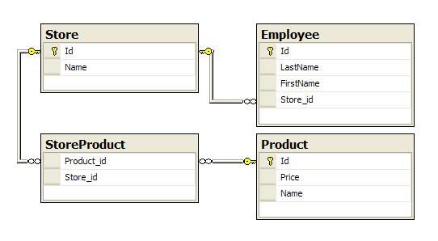
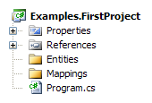

# Fluent NHibernate in a Nutshell

Fluent NHibernate offers an alternative to NHibernate's standard XML mapping files. Rather than writing XML documents (.hbm.xml files), Fluent NHibernate lets you write mappings in strongly typed C# code. This allows for easy refactoring, improved readability and more concise code. 

Fluent NHibernate also has several other tools, including:

  * [[Auto mappings|Auto mapping]] - where mappings are inferred from the design of your entities
  * [[Persistence specification testing]] - round-trip testing for your entities, without ever having to write a line of CRUD
  * Full application configuration with our [[Fluent configuration]] API
  * [[Database configuration]] - fluently configure your database in code

Fluent NHibernate is external to the [NHibernate Core](http://nhforge.org/media/p/4.aspx), but is fully compatible with NHibernate version 2.1, and is experimentally compatible with NHibernate trunk.

# Background

[NHibernate](http://nhforge.org/) is an [Object Relational Mapping](http://en.wikipedia.org/wiki/Object-relational_mapping) framework, which (as ORM states) maps between relational data and objects. It defines its mappings in an XML format called HBM, each class has a corresponding HBM XML file that maps it to a particular structure in the database. It's these mapping files that [Fluent NHibernate](http://fluentnhibernate.org) provides a replacement for.

**Why replace HBM.XML?** While the separation of code and XML is nice, it can lead to several undesirable situations.

  * Due to XML not being evaluated by the compiler, you can rename properties in your classes that aren't updated in your mappings; in this situation, you wouldn't find out about the breakage until the mappings are parsed at runtime.
  * XML is verbose; NHibernate has gradually reduced the mandatory XML elements, but you still can't escape the verbosity of XML.
  * Repetitive mappings - NHibernate HBM mappings can become quite verbose if you find yourself specifying the same rules over again. For example if you need to ensure all `string` properties mustn't be nullable and should have a length of 1000, and all `int`s must have a default value of `-1`.

**How does Fluent NHibernate counter these issues?** It does so by moving your mappings into actual code, so they're compiled along with the rest of your application; rename refactorings will alter your mappings just like they should, and the compiler will fail on any typos. As for the repetition, Fluent NHibernate has a conventional configuration system, where you can specify patterns for overriding naming conventions and many other things; you set how things should be named once, then Fluent NHibernate does the rest.

# Simple example

Here's a simple example so you know what you're getting into.

## Traditional HBM XML mapping

    <?xml version="1.0" encoding="utf-8" ?>  
    <hibernate-mapping xmlns="urn:nhibernate-mapping-2.2"  
      namespace="QuickStart" assembly="QuickStart">  
      
      <class name="Cat" table="Cat">  
        <id name="Id">  
          <generator class="identity" />  
        </id>  
      
        <property name="Name">  
          <column name="Name" length="16" not-null="true" />  
        </property>  
        <property name="Sex" />  
        <many-to-one name="Mate" />  
        <bag name="Kittens">  
          <key column="mother_id" />  
          <one-to-many class="Cat" />  
        </bag>  
      </class>  
    </hibernate-mapping> 

## Fluent NHibernate equivalent

    public class CatMap : ClassMap<Cat>
    {
      public CatMap()
      {
        Id(x => x.Id);
        Map(x => x.Name)
          .Length(16)
          .Not.Nullable();
        Map(x => x.Sex);
        References(x => x.Mate);
        HasMany(x => x.Kittens);
      }
    }

# Installation
## Binaries

Each release is made available on NuGet, and you should use that if at all possible. See: [Fluent NHibernate NuGet package](http://nuget.org/packages/FluentNHibernate).

    PM> Install-Package FluentNHibernate

Binaries are also available for a short period from our CI server, [teamcity.codebetter.com](http://teamcity.codebetter.com/viewType.html?buildTypeId=bt9&tab=buildTypeStatusDiv), one for each successful build.

## Getting the source

Our source-control is [Git](http://git-scm.com/) using [Github](http://github.com), and you have two options available. If you plan on modifying Fluent NHibernate and contributing back to us, then you're best forking our repository and sending us a pull request. You can find out more about that on the github guides site: [forking](http://github.com/guides/fork-a-project-and-submit-your-modifications) and [pull requests](http://github.com/guides/pull-requests). The other option is a direct clone of our repository, but that will leave you in an awkward state if you ever do plan to contribute (but it's fine if you don't).

Our repository is located at: http://github.com/jagregory/fluent-nhibernate

Again, we recommend forking our repository; if you don't want to do that, you can do a direct clone:

`git clone git://github.com/jagregory/fluent-nhibernate.git`

Once you've got a copy on your local machine, there are two ways you can do a build.

  * **If you have [Ruby](http://www.ruby-lang.org) installed:** The first time you build, you should run `InstallGems.bat` from the Fluent NHibernate root directory; this makes sure your machine has all the [gems](http://www.rubygems.org/) required to build successfully. Once that's completed, and for all subsequent builds, you need to run `Build.bat`; this batch file runs our [Rake](http://rake.rubyforge.org/) script which builds the standard NHibernate 2.0 version and outputs it in the `build` directory. For more options for building, see the details of our [[rake script]].
  * **Without Ruby:** Open up the `src\FluentNHibernate.sln` solution in Visual Studio and do a build, you can optionally run the tests too.

Now that you've got Fluent NHibernate built, you just need to reference the `FluentNHibernate.dll` assembly in your project.

# Your first project

> All the source can be found in the main Fluent NHibernate solution, in the [Example.FirstProject](http://github.com/jagregory/fluent-nhibernate/tree/master/src/Examples.FirstProject) project.

You need to have Fluent NHibernate already downloaded and compiled to follow this guide, if you haven't done that yet then please refer to the installation section above.

For this example we're going to be mapping a simple domain for a retail company. The company has a couple of stores, each with products in (some products are in both stores, some are exclusive), and each with employees. In database terms, that's a <code>Store</code>, <code>Employee</code>, and <code>Product</code> table, with a many-to-many table between <code>Store</code> and <code>Product</code>.

First, create a console application and reference the <code>FluentNHibernate.dll</code> you built earlier, and whichever version of <code>NHibernate.dll</code> you built against (if you're unsure, just use the one that's output with <code>FluentNHibernate.dll</code>); also, because for this example we're going to be using a [SQLite](http://www.sqlite.org/) database, you'll need the [System.Data.SQLite](http://sourceforge.net/projects/sqlite-dotnet2) library which is distributed with Fluent NHibernate.

You can see the project structure that I used to the left. The <code>Entities</code> folder is for your actual domain objects, while the <code>Mappings</code> folder is where we're going to put your fluent mapping classes.

For the rest of this guide I'm going to assume you've used the same structure.

## Entities

Now that we've got our project setup, let's start by creating our entities. We've got three tables we need to map (we're ignoring the many-to-many join table right now), so that's one entity per table. Create the following classes in your <code>Entities</code> folder.

    public class Employee
    {
      public virtual int Id { get; protected set; }
      public virtual string FirstName { get; set; }
      public virtual string LastName { get; set; }
      public virtual Store Store { get; set; }
    }

Our <code>Employee</code> entity has an <code>Id</code>, the person's name (split over <code>FirstName</code> and <code>LastName</code>), and finally a reference to the <code>Store</code> that they work in.

There's two things that may stand out to you if you're unfamiliar with NHibernate. Firstly, the <code>Id</code> property has a private setter, this is because it's only NHibernate that should be setting the value of that <code>Id</code>. Secondly, all the properties are marked <code>virtual</code>; this is because NHibernate creates "proxies" of your entities at run time to allow for lazy loading, and for it to do that it needs to be able to override the properties.

    public class Product
    {
      public virtual int Id { get; protected set; }
      public virtual string Name { get; set; }
      public virtual double Price { get; set; }
      public virtual IList<Store> StoresStockedIn { get; protected set; }
    
      public Product()
      {
        StoresStockedIn = new List<Store>();
      }
    }

<code>Product</code> has an <code>Id</code>, it's <code>Name</code>, <code>Price</code>, and a collection of <code>Store</code>s that stock it.

    public class Store
    {
      public virtual int Id { get; protected set; }
      public virtual string Name { get; set; }
      public virtual IList<Product> Products { get; set; }
      public virtual IList<Employee> Staff { get; set; }
    
      public Store()
      {
        Products = new List<Product>();
        Staff = new List<Employee>();
      }
    
      public virtual void AddProduct(Product product)
      {
        product.StoresStockedIn.Add(this);
        Products.Add(product);
      }
    
      public virtual void AddEmployee(Employee employee)
      {
        employee.Store = this;
        Staff.Add(employee);
      }
    }

Finally, we've got our <code>Store</code> entity. This has an <code>Id</code> and a <code>Name</code>, along with a collection of <code>Product</code>s that are stocked in it, as well as a collection of <code>Employee</code>s (in the <code>Staff</code> list)  that work there. This entity has a little bit of logic in it to make our code simpler, that's the <code>AddProduct</code> and <code>AddEmployee</code> methods; these methods are used to add items into the collections, and setup the other side of the relationships.

> If you're an NHibernate veteran then you'll recognise this; however, if it's all new to you then let me explain: in a relationship where both sides are mapped, NHibernate needs you to set both sides before it will save correctly. So as to not have this extra code everywhere, it's been reduced to these extra methods in <code>Store</code>.

## Mappings

Now that we've got our entities created, it's time to map them using Fluent NHibernate. We'll start with the simplest class, which is <code>Employee</code>. All the following mappings should be created inside the <code>Mappings</code> folder.

To map an entity, you have to create a dedicated mapping class (typically this follows the naming convention of \EntityNameMap), so we'll create an <code>EmployeeMap</code> class; these mapping classes have to derive from <code>ClassMap<T></code> where <code>T</code> is your entity.

    public class EmployeeMap : ClassMap<Employee>
    {
      
    }

The mappings themselves are done inside the constructor for <code>EmployeeMap</code>, so we need to add a constructor and write the mappings.

    public class EmployeeMap : ClassMap<Employee>
    {
      public EmployeeMap()
      {
        Id(x => x.Id);
      }
    }

To start with we've mapped the <code>Id</code> column, and told Fluent NHibernate that it's actually an identifier. The <code>x</code> in this example is an instance of <code>Employee</code> that Fluent NHibernate uses to retrieve the property details from, so all you're really doing here is telling it which property you want your Id to be. Fluent NHibernate will see that your <code>Id</code> property has a type of <code>int</code>, and it'll automatically decide that it should be mapped as an auto-incrementing identity in the database - handy!

> For NHibernate users, that means it automatically creates the <code>generator</code> element as <code>identity</code>.

Let's map the rest of <code>Employee</code>.

    public class EmployeeMap : ClassMap<Employee>
    {
      public EmployeeMap()
      {
        Id(x => x.Id);
        Map(x => x.FirstName);
        Map(x => x.LastName);
        References(x => x.Store);
      }
    }

There are a couple of new methods we've used there, <code>Map</code> and <code>References</code>; <code>Map</code> creates a mapping for a simple property, while <code>References</code> creates a many-to-one relationship between two entities. In this case we've mapped <code>FirstName</code> and <code>LastName</code> as simple properties, and created a many-to-one to <code>Store</code> (many <code>Employee</code>s to one <code>Store</code>) through the <code>Store</code> property.

> NHibernate users: <code>Map</code> is equivalent to the <code>property</code> element and <code>References</code> to <code>many-to-one</code>.

Let's carry on by mapping the <code>Store</code>.

    public class StoreMap : ClassMap<Store>
    {
      public StoreMap()
      {
        Id(x => x.Id);
        Map(x => x.Name);
        HasMany(x => x.Staff)
          .Inverse()
          .Cascade.All();
        HasManyToMany(x => x.Products)
         .Cascade.All()
         .Table("StoreProduct");
      }
    }

Again, there's a couple of new calls here. If you remember back to <code>Employee</code>, we created a many-to-one relationship with <code>Store</code>, well now that we're mapping <code>Store</code> we can create the other side of that relationship. So <code>HasMany</code> is creating a one-to-many relationship with <code>Employee</code> (one <code>Store</code> to many <code>Employee</code>s), which is the other side of the <code>Employee.Store</code> relationship. The other new method is <code>HasManyToMany</code>, which creates a many-to-many relationship with <code>Product</code>.

You've also just got your first taste of the fluent interface Fluent NHibernate provides. The <code>HasMany</code> method has a second call directly from it's return type (<code>Inverse()</code>), and <code>HasManyToMany</code> has <code>Cascade.All()</code> and <code>Table</code>; this is called method chaining, and it's used to create a more natural language in your configuration.

  * <code>Inverse</code> on <code>HasMany</code> is an NHibernate term, and it means that the other end of the relationship is responsible for saving.
  * <code>Cascade.All</code> on <code>HasManyToMany</code> tells NHibernate to cascade events down to the entities in the collection (so when you save the <code>Store</code>, all the <code>Product</code>s are saved too).
  * <code>Table</code> sets the many-to-many join table name.

> The <code>Table</code> call is currently only required if you're doing a bidirectional many-to-many, because Fluent NHibernate currently can't guess what the name should be; for all other associations it isn't required.

> For NHibernaters: <code>HasMany</code> maps to a <code>bag</code> by default, and has a <code>one-to-many</code> element inside; <code>HasManyToMany</code> is the same, but with a <code>many-to-many</code> element.

Finally, let's map the <code>Product</code>.

    public class ProductMap : ClassMap<Product>
    {
      public ProductMap()
      {
        Id(x => x.Id);
        Map(x => x.Name);
        Map(x => x.Price);
        HasManyToMany(x => x.StoresStockedIn)
          .Cascade.All()
          .Inverse()
          .Table("StoreProduct");
      }
    }

That's the <code>Product</code> mapped; in this case we've used only methods that we've already encountered. The <code>HasManyToMany</code> is setting up the other side of the bidirectional many-to-many relationship with <code>Store</code>.

## Application

In this section we'll initialise some data and output it to the console.

    static void Main()
    {
      var sessionFactory = CreateSessionFactory();
    
      using (var session = sessionFactory.OpenSession())
      {
        using (var transaction = session.BeginTransaction())
        {
          // create a couple of Stores each with some Products and Employees
          var barginBasin = new Store { Name = "Bargin Basin" };
          var superMart = new Store { Name = "SuperMart" };
    
          var potatoes = new Product { Name = "Potatoes", Price = 3.60 };
          var fish = new Product { Name = "Fish", Price = 4.49 };
          var milk = new Product { Name = "Milk", Price = 0.79 };
          var bread = new Product { Name = "Bread", Price = 1.29 };
          var cheese = new Product { Name = "Cheese", Price = 2.10 };
          var waffles = new Product { Name = "Waffles", Price = 2.41 };
    
          var daisy = new Employee { FirstName = "Daisy", LastName = "Harrison" };
          var jack = new Employee { FirstName = "Jack", LastName = "Torrance" };
          var sue = new Employee { FirstName = "Sue", LastName = "Walkters" };
          var bill = new Employee { FirstName = "Bill", LastName = "Taft" };
          var joan = new Employee { FirstName = "Joan", LastName = "Pope" };
    
          // add products to the stores, there's some crossover in the products in each
          // store, because the store-product relationship is many-to-many
          AddProductsToStore(barginBasin, potatoes, fish, milk, bread, cheese);
          AddProductsToStore(superMart, bread, cheese, waffles);
    
          // add employees to the stores, this relationship is a one-to-many, so one
          // employee can only work at one store at a time
          AddEmployeesToStore(barginBasin, daisy, jack, sue);
          AddEmployeesToStore(superMart, bill, joan);
    
          // save both stores, this saves everything else via cascading
          session.SaveOrUpdate(barginBasin);
          session.SaveOrUpdate(superMart);
    
          transaction.Commit();
        }
    
        // retreive all stores and display them
        using (session.BeginTransaction())
        {
          var stores = session.CreateCriteria(typeof(Store))
            .List<Store>();
    
          foreach (var store in stores)
          {
            WriteStorePretty(store);
          }
        }
    
        Console.ReadKey();
      }
    }
    
    public static void AddProductsToStore(Store store, params Product[] products)
    {
      foreach (var product in products)
      {
        store.AddProduct(product);
      }
    }
    
    public static void AddEmployeesToStore(Store store, params Employee[] employees)
    {
      foreach (var employee in employees)
      {
        store.AddEmployee(employee);
      }
    }

> For brevity, I've left out the definition of <code>WriteStorePretty</code> which simply calls <code>Console.Write</code> for the various relationships on a <code>Store</code> (but you can see it in the [full code](http://github.com/jagregory/fluent-nhibernate/blob/master/src/Examples.FirstProject/Program.cs)).

This is the <code>Main</code> method from your <code>Program.cs</code>. It's a bit lengthy, but what we're doing is creating a couple of <code>Store</code> instances, then adds some <code>Employee</code>s and <code>Product</code>s to them, then saves; finally, it re-queries them from the database and writes them out to the console.

You won't be able to run this yet, because there's one thing left to do. We need to implement the <code>CreateSessionFactory</code> method; that's where our configuration goes to tie NHibernate and Fluent NHibernate together.

## Configuration

Let's implement the <code>CreateSessionFactory</code> method.

    private static ISessionFactory CreateSessionFactory()
    {
    
    }

That's the method signature sorted, you'll note it's returning an NHibernate <code>ISessionFactory</code>. Now we're going to use the Fluent NHibernate <code>Fluently.Configure</code> API to configure our application. You can see more examples on this in the [[Fluent configuration]] wiki page. 

    private static ISessionFactory CreateSessionFactory()
    {
      return Fluently.Configure()
        .BuildSessionFactory();
    }

That's not quite right yet, we're creating a <code>SessionFactory</code>, but we haven't configured anything yet; so let's configure our database.

    private static ISessionFactory CreateSessionFactory()
    {
      return Fluently.Configure()
        .Database(
          SQLiteConfiguration.Standard
            .UsingFile("firstProject.db")
        )
        .BuildSessionFactory();
    }

There we go, we've specified that we're using a file-based SQLite database. You can learn more about the database configuration API in the [[Database configuration]] wiki page.

Just one more thing to go, we need to supply NHibernate with the mappings we've created. To do that, we add a call to <code>Mappings</code> in our configuration.

    private static ISessionFactory CreateSessionFactory()
    {
      return Fluently.Configure()
        .Database(
          SQLiteConfiguration.Standard
            .UsingFile("firstProject.db")
        )
        .Mappings(m =>
          m.FluentMappings.AddFromAssemblyOf<Program>())
        .BuildSessionFactory();
    }

That's it; that's your application configured!

You should now be able to run the application and see the results of your query output to the console window (provided that you've actually created the SQLite database schema; otherwise, see the Schema generation section below).

    Bargin Basin
      Products:
        Potatoes
        Fish
        Milk
        Bread
        Cheese
      Staff:
        Daisy Harrison
        Jack Torrance
        Sue Walkters
    
    SuperMart
      Products:
        Bread
        Cheese
        Waffles
      Staff:
        Bill Taft
        Joan Pope

There you go; that's your first Fluent NHibernate project created and running!

## Schema generation

If you haven't manually created the schema for this application, then it will fail on the first time you run it. There's something you can do about that, but it needs to be done directly against the NHibernate <code>Configuration</code> object; we can do that using the <code>ExposeConfiguration</code> method. Combine that call with a method to generate the schema, then you're able to create your schema at runtime.

    private static ISessionFactory CreateSessionFactory()
    {
      return Fluently.Configure()
        .Database(
          SQLiteConfiguration.Standard
            .UsingFile("firstProject.db")
        )
        .Mappings(m =>
          m.FluentMappings.AddFromAssemblyOf<Program>())
        .ExposeConfiguration(BuildSchema)
        .BuildSessionFactory();
    }
    
    private static void BuildSchema(Configuration config)
    {
      // delete the existing db on each run
      if (File.Exists(DbFile))
        File.Delete(DbFile);
    
      // this NHibernate tool takes a configuration (with mapping info in)
      // and exports a database schema from it
      new SchemaExport(config)
        .Create(false, true);
    }

You can read more about this in the [[Fluent configuration]] wiki page.